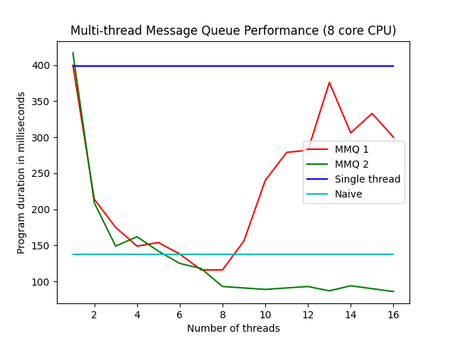

# Multi-threaded Message Queue

The goal of this simple project is to showcase multi-threaded data processing using the C++ standard library. 

The MMQ1 implementation (in `./src/mmq.cpp`) uses an atomic bitmap to keep track of available threads, and deploys messages to those threads synchronously. The `AddMessage` call is therefore blocking whenever all threads are busy, but the data processing itself takes place asynchronously in the worker threads.

The MMQ 2 implementation (in `./src/mmq2.cpp`) uses a lock-free queue (in `./include/lock_free_queue.hpp`) to deploy messages to threads asynchronously with `AddMessageAsync`. MMQ 2 is lockess and non-blocking throughout. This is reflected in MMQ 2's better performance with higher thread counts when compared to MMQ 1.

The plot below was produced on an 8-core CPU in a Release build, and shows maximum efficiency at roughly around 8 threads.



The single thread case is provided in blue as a benchmark or sanity check. Note that MMQ 1 and MMQ 2 both perform similarly to the single-threaded case when number of threads is equal to 1.

A naive multi-threaded implementation is also provided, and presented in cyan. In this case, a new worker thread is created dynamically with each `AddMessageAsync` call. Therefore there could potentially be as many as N threads active at a time, where N is the number of total messages to be processed (500 in this example). The overhead of creating and removing threads dynamically plus context switching between a very large number of software threads causes this approach to be much less efficient than a well-orchestrated message queue.

## Usage

To build using CMake and run:

```
cd ./build/release
cmake -DCMAKE_BUILD_TYPE=Release ../..
make
./MMQ
```